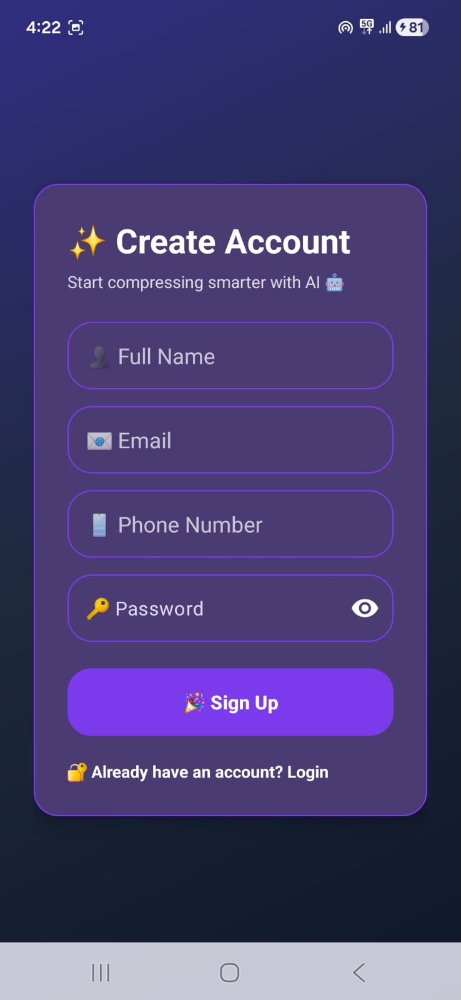
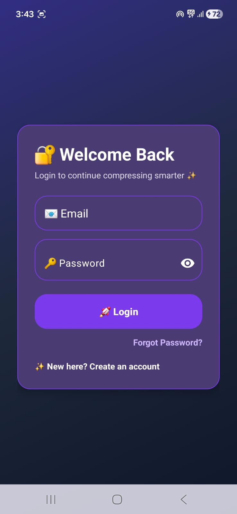
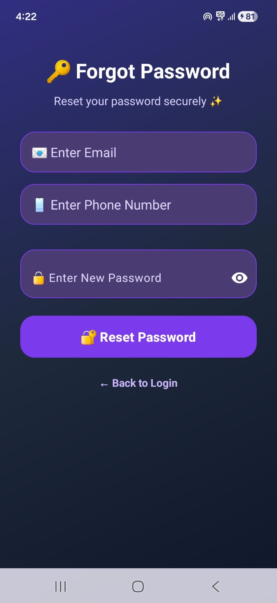
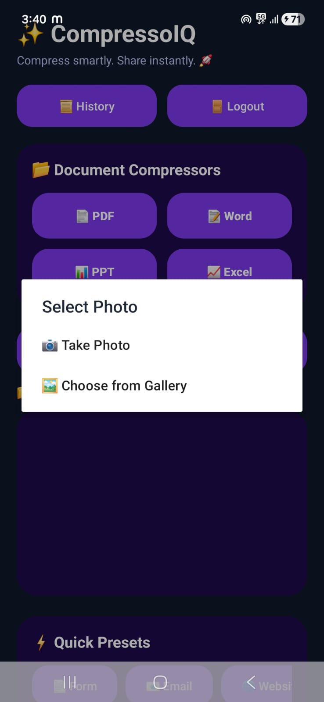
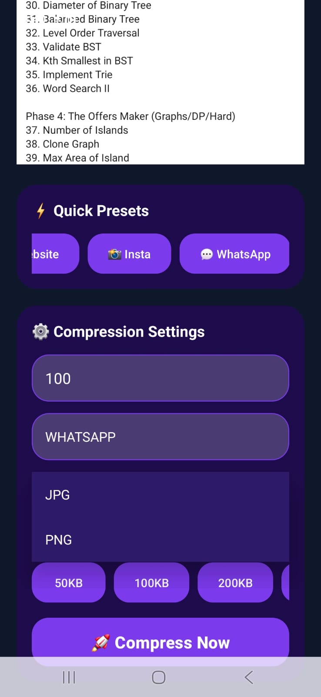
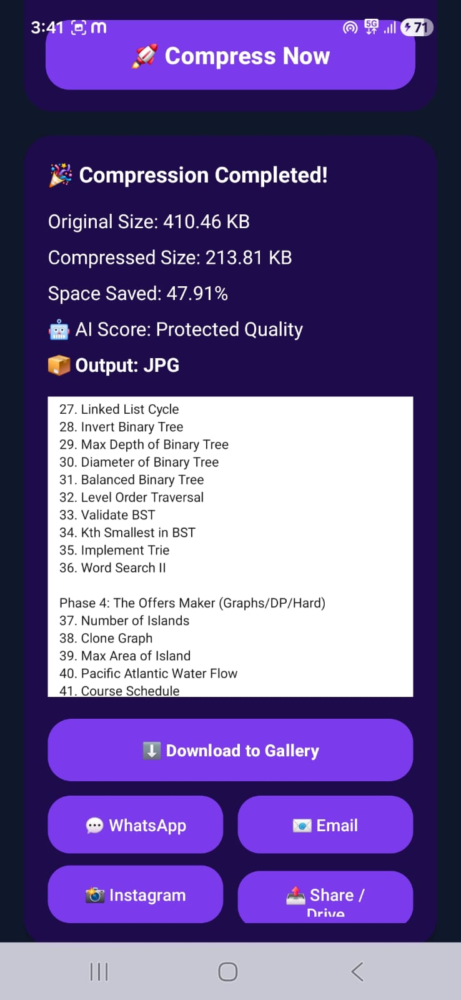
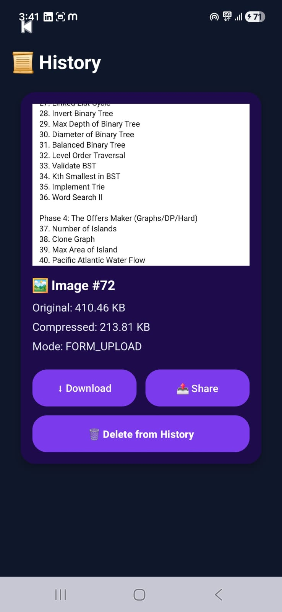
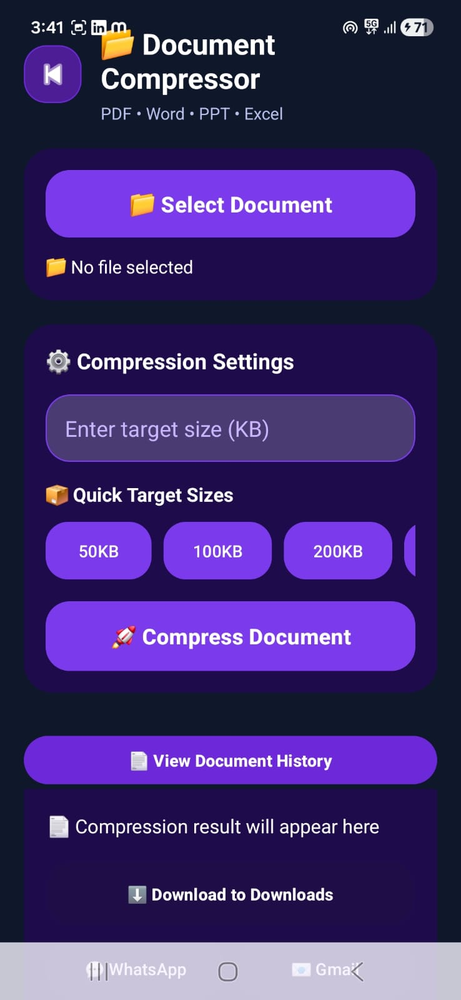
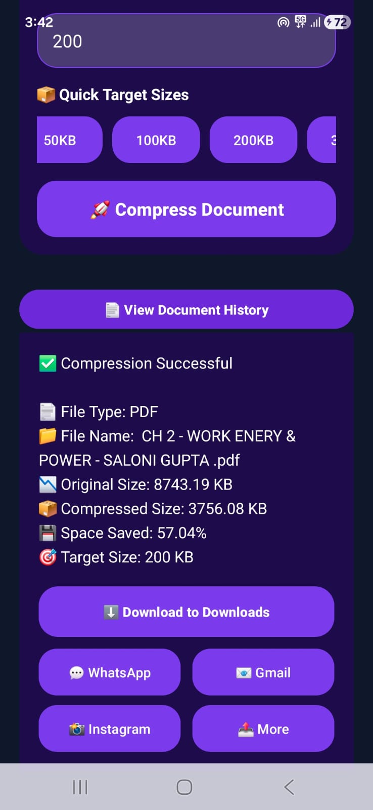
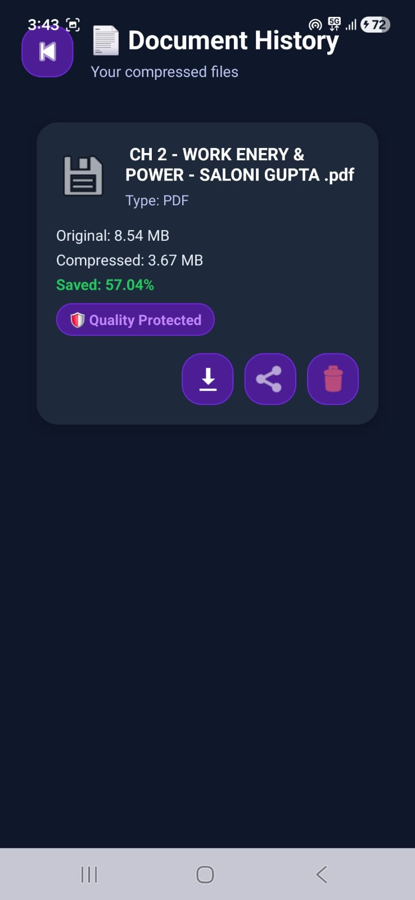

# 🚀 CompressoIQ - AI Photo & Document Compressor

CompressoIQ is an Android application that intelligently compresses **images and documents** while trying to maintain quality and usability.
It helps users reduce file size for easier sharing, storage saving, and faster uploads.

---

## 📱 Features

### 🔐 User Authentication

* Signup
* Login
* Forgot Password

### 🖼️ Image Compression

* Take photo or choose from gallery
* Compress images with target size options
* Output format selection (JPG / PNG)
* Quick presets for platforms like WhatsApp / Instagram / Email / Website
* Download and share compressed images

### 📄 Document Compression

* Compress PDF, Word, PPT, and Excel files
* Target size input and quick size presets
* Download and share compressed documents

### 📜 History Management

* View compressed image history
* View compressed document history
* Download / Share / Delete history items

### 🎨 Modern UI

* Dark-themed purple neon-inspired design
* Clean and user-friendly Android interface

---

## 🛠 Tech Stack

### Frontend

* Java
* XML
* Android Studio

### Backend

* Spring Boot
* Java
* REST APIs

### Database

* MySQL

---

## 📸 App Screenshots

### 1. Signup Screen

  

### 2. Login Screen

  

### 3. Forgot Password

  

### 4. Home Dashboard

  

### 5. Image Compression Settings

  

### 6. Image Compression Result

  

### 7. Image History

  

### 8. Document Compression Screen

  

### 9. Document Compression Result

  

### 10. Document History

  

---

## 🔗 Repositories

### Android Frontend

[CompressoIQ-Android](https://github.com/Salonniii/CompressoIQ-Android)

### Backend

[CompressoIQ-Backend](https://github.com/Salonniii/CompressoIQ-Backend)

---

## 👩‍💻 Author

**Saloni Gupta**

---

## 📌 Project Note

This project was built as a practical **full-stack Android application** combining:

* Android frontend development
* Spring Boot backend APIs
* MySQL database integration
* File compression and history management features
